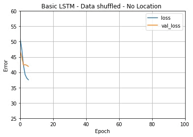

# Predicting Urban Air Pollution 
## by Konstantin Strömel, Tjark Darius & Johannes Claassen 

#### This Project is part of the course "Implementing ANNs with TensorFlow" in the WS21/22 taught by Prof. Dr. Gordon Pipa and Leon Schmid, Charlotte Lange, Robin Horn, Mathis Pink, Kristina Kobrock.
 

Source: https://www.euro.who.int/__data/assets/image/0006/370392/Air-pollution-INFOGRAPHICS-English-1-600.png 

 

 
In this project we tested four different models on the provided weather and satellite data. We used a Linear Regression Model, a Multi-Layer Perceptron, a Convolutional Neural Network and a Long-Short Term Memory model.  
The LSTM is our best performing model:  
It uses shuffled data without locations and without any rigorous optimization techniques.
 
 
 

 
 

 

The data folder contains the raw and cleaned data for our project.

The data preparation folder contains the scripts we have used for data exploration and preprocessing.

The meetings folder contains notes we made during our meetings.

The model folder will eventually contain our model.

The report folder will eventually contain our final report. 
The final report will be written in LaTeX using overleaf, which can be found here:
https://sharelatex.gwdg.de/project/622a0da2fa90ce008e771e90
